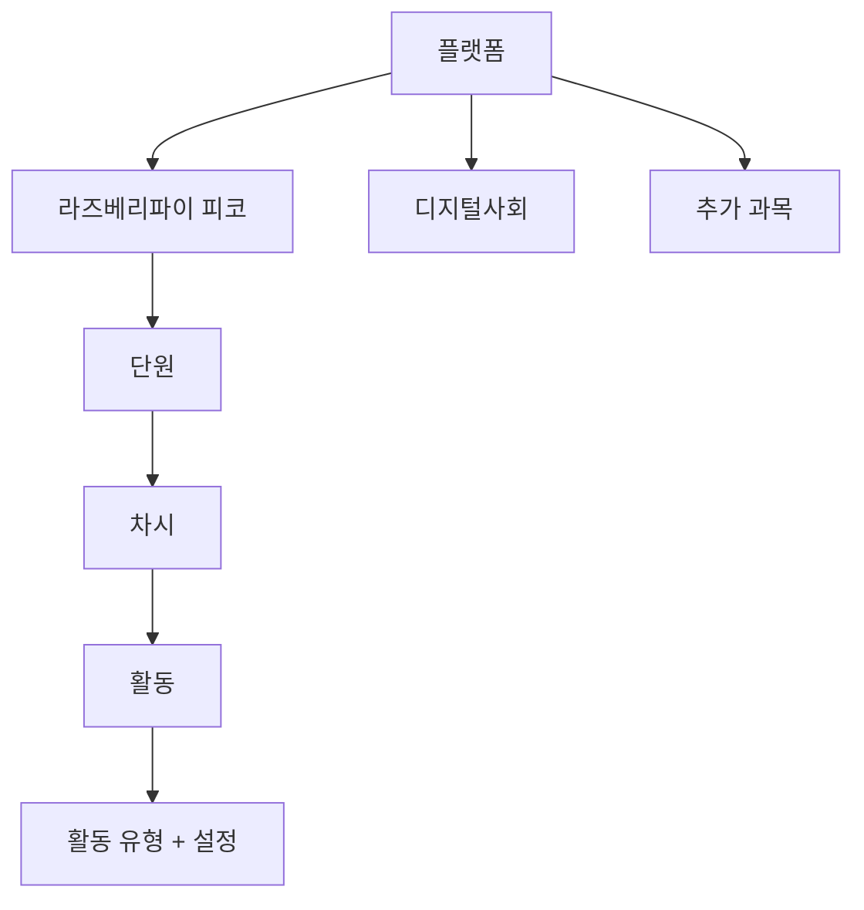
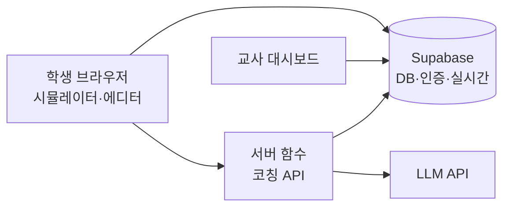

# PRD: 피코·디지털사회 학습 플랫폼

Sep 23, 2026 · @SangheeOh

## 1. 개요

라즈베리파이 피코 가상 실습과 디지털사회 수업을 하나의 웹 플랫폼에서 운영하고, 학생의 학습 과정을 자동으로 기록해 교사가 개별 피드백을 줄 수 있게 한다. 기존 PicoSim 시뮬레이터를 핵심 모듈로 흡수하고, 콘텐츠는 과목·단원 단위로 계속 추가할 수 있는 구조로 만든다.

**해결하려는 문제**

- 결과물만 제출받으면 학생이 어디서 막혔고 어떻게 해결했는지 알 수 없어 피드백 근거가 부족하다.
- 실물 피코 키트는 수량·파손·배선 시간 때문에 한 차시 안에서 반복 실습이 어렵다.
- 생성형 AI에 답을 받아 붙여넣는 인지적 외주화가 늘고 있지만, 교사가 이를 확인할 방법이 없다.

**제품 비전**: 학생은 스스로 생각하며 만들고, 교사는 그 과정을 보며 피드백한다.

## 2. 목표와 비목표

**목표**

1. 학생의 코드·회로·질문·성찰을 시간순으로 자동 기록하고, 교사가 학생별로 재생해 볼 수 있다.
2. 설치 없이 브라우저에서 피코 회로 구성과 MicroPython 실행을 할 수 있다.
3. AI 코치는 정답 대신 질문과 단계적 힌트로 학생의 사고를 이끈다.
4. 교사가 코드 수정 없이 새 과목·단원·활동을 추가할 수 있다.

**비목표 (v1 제외)**

- 성적 자동 산출, NEIS 연동
- 실물 피코 펌웨어 설치 자동화 (코드 전송은 5장 BR-04에서 지원)
- 학부모 포털, 범용 LMS 대체

**성공 지표** (목표치는 가정이며 파일럿 후 조정)

| 지표 | 목표치 |
| --- | --- |
| 학생 1명 피드백 작성 시간 | 기존 대비 50% 단축 |
| 활동 완료율 | 80% 이상 |
| 코칭 해결 후 자기설명 입력률 | 70% 이상 |
| 시뮬레이터 첫 실행까지 걸리는 시간 | 10초 이내 |
| 교사가 새 활동 1개 추가에 드는 시간 | 30분 이내 |

## 3. 사용자와 핵심 시나리오

| 사용자 | 특징 | 핵심 요구 |
| --- | --- | --- |
| 학생 (중1\~3) | 파이썬 입문 수준, 크롬북·교실 PC 사용 | 쉽게 시작, 막혔을 때 도움, 내 진행 확인 |
| 교사 (운영자) | 수업 운영 + 콘텐츠 작성 | 학급 현황 파악, 개별 피드백, 활동 추가 |
| 협력 교사 (추후) | 같은 콘텐츠로 다른 학급 운영 | 자기 학급만 관리 |

**S1. 학생 실습** — 수업 코드로 로그인 → 오늘의 활동 열기 → 부품 드래그로 회로 구성 → 코드 작성·실행 → 오류 발생 → 코치에게 "무엇을 시도했는지"와 함께 질문 → 힌트 받고 수정 → 체크포인트 통과 → 한 줄 성찰 후 제출.

**S2. 수업 중 순회 지도** — 교사가 학급 대시보드를 띄워 두면, 연속 오류나 장시간 무진행 학생이 "막힘"으로 표시된다. 교사는 해당 학생에게 바로 간다.

**S3. 수업 후 개별 피드백** — 교사가 학생 타임라인에서 코드 변경 과정, 코칭 대화, 성찰을 훑어보고 코드 줄에 코멘트를 단다. 학생은 다음 접속 때 알림으로 확인한다.

**S4. 콘텐츠 추가** — 교사가 새 차시에 활동을 만들고, 유형(시뮬레이터 과제·퀴즈·서술 등), 제공 부품, 코칭 수준, 체크포인트를 설정해 게시한다.

**S5. 디지털사회 토론** — 학생이 사례를 읽고 입장과 근거를 쓰면, 논증 코치가 근거의 약점을 질문한다. 이후 동료 글에 피드백을 남긴다.

## 4. 정보 구조와 콘텐츠 모델

콘텐츠는 과목 → 단원 → 차시 → 활동 4단계로 구성하고, 활동은 "유형"을 골라 설정만 채우는 방식으로 추가한다. 새 과목은 설정 추가만으로 늘어나므로 두 과목 이후 확장도 같은 구조를 쓴다.

학급은 콘텐츠와 분리해, 한 콘텐츠를 여러 학급에 배정하고 학급별로 공개 시점을 정한다.

| 활동 유형 | 설명 | 주 사용 과목 |
| --- | --- | --- |
| 개념 읽기 | 마크다운·이미지·영상 | 공통 |
| 퀴즈 | 객관식·단답, 즉시 채점 | 공통 |
| 시뮬레이터 과제 | 회로 구성 + 코드, 체크포인트 점검 | 피코 |
| 코드 과제 | 회로 없이 MicroPython만 | 피코 |
| 서술·성찰 | 자유 서술, 루브릭 연결 | 공통 |
| 토론·동료 피드백 | 입장·근거 작성, 상호 댓글 | 디지털사회 |
| 시나리오 선택 | 분기형 상황 판단 | 디지털사회 |

각 활동은 `activity.json`(유형, 목표, 제공 부품, 코칭 수준, 체크포인트)과 본문 마크다운으로 정의한다. 새 활동 유형은 "렌더러 + 기록할 이벤트 목록"을 구현하면 플러그인처럼 추가된다.

## 5. 기능 요구사항: 피코 시뮬레이터

학생은 한 화면에서 왼쪽 회로 캔버스, 오른쪽 코드 에디터·콘솔로 작업하며, 모든 조작은 학습 기록으로 남는다. 우선순위는 P0(MVP 필수) · P1(MVP 직후) · P2(확장)이다.

| ID | 요구사항 | 우선순위 |
| --- | --- | --- |
| SIM-01 | 부품 팔레트에서 브레드보드로 드래그 배치, 회전·삭제 | P0 |
| SIM-02 | 핀 사이 와이어 연결, 피코 핀맵(GP0\~GP28, 3V3, GND) 호버 표시 | P0 |
| SIM-03 | 기본 부품: 온보드 LED, LED, 저항, 푸시버튼, 가변저항, 부저 | P0 |
| SIM-04 | 확장 부품: 서보, 초음파 센서, 조도 센서, NeoPixel | P1 |
| SIM-05 | 고급 부품: I2C OLED, 온습도 센서 | P2 |
| SIM-06 | 교사가 활동별로 사용 가능 부품 제한, 미리 배치된 회로 제공 | P0 |
| SIM-07 | 회로 점검: 저항 없는 LED, 단락, 미연결 핀을 교육적 메시지로 경고 | P1 |
| SIM-10 | 코드 에디터: 구문 강조, 줄 번호, 자동완성은 교사가 끌 수 있음 | P0 |
| SIM-11 | MicroPython 실행: `machine.Pin`, `PWM`, `ADC`, `time` | P0 |
| SIM-12 | `I2C` 등 추가 모듈 | P2 |
| SIM-13 | 시리얼 콘솔 출력과 오류 표시 | P0 |
| SIM-14 | 오류 메시지 한국어 해설 (예: `NameError` → "정의되지 않은 이름") | P1 |
| SIM-15 | 핀 상태·변수 모니터 패널 | P1 |
| SIM-16 | 체크포인트 자동 점검 (예: "GP15가 1초 간격으로 켜졌다 꺼지는가"를 핀 로그로 판정) | P1 |
| SIM-17 | 일시정지·단계 실행·속도 조절 | P2 |
| SIM-18 | 회로+코드 프로젝트 저장, 불러오기, 공유 링크 | P0 |

외부 코드 붙여넣기(예: 5줄 이상 한 번에 입력)는 차단하지 않고 이벤트로 기록해 교사 대시보드에 표시한다. 차단보다 가시화가 학생 반발이 적고 대화 소재가 된다.

**실물 연계 (가상 → 실물 브릿지)**

시뮬레이터에서 통과한 코드는 한 글자도 바꾸지 않고 실물 피코에서 똑같이 동작해야 한다. 이를 위해 시뮬레이터는 실물과 같은 MicroPython 펌웨어를 가상 칩 위에서 그대로 실행한다(10장).

| ID | 요구사항 | 우선순위 |
| --- | --- | --- |
| BR-01 | 실물과 같은 MicroPython 펌웨어 버전 사용, 오류 메시지·REPL 동작 동일 | P0 |
| BR-02 | 코드 복사, `main.py` 다운로드로 Thonny에서 바로 열기 | P0 |
| BR-03 | 가상 회로를 실물 배선도로 출력 (핀 번호, 부품 위치, 저항값, LED 극성) | P1 |
| BR-04 | "실물로 보내기": 크로미움 계열 브라우저의 Web Serial로 USB 연결된 피코에 코드 전송·실행, 시리얼 출력 표시 | P1 |
| BR-05 | 실물에서만 생기는 문제(접촉 불량, LED 극성, 전원, 핀 헤더) 점검 카드 | P1 |
| BR-06 | 실물 실행 결과(성공·실패·사진)를 학생이 기록해 타임라인에 남김 | P2 |

## 6. 기능 요구사항: AI 코칭

코치는 정답 코드를 주지 않는다. 학생이 먼저 설명하고, 시도할 때마다 힌트가 한 단계씩 구체화되는 "힌트 사다리"가 핵심이다.

**힌트 사다리**

| 단계 | 코치 행동 | 예시 |
| --- | --- | --- |
| L0 되묻기 | 학생이 기대한 동작과 실제 동작을 말하게 함 | "LED가 어떻게 되길 기대했어? 실제로는?" |
| L1 개념 힌트 | 관련 개념만 짚음 | "핀을 출력으로 쓰려면 어떤 설정이 필요할까?" |
| L2 위치 힌트 | 문제가 있는 줄 범위를 알려 줌 | "3\~5번째 줄의 핀 번호를 회로와 비교해 봐" |
| L3 유사 예시 | 과제와 다른 상황의 짧은 예시 (3줄 이하) | 다른 핀·다른 부품으로 된 예 |
| 교사 호출 | L3 이후에도 막히면 대시보드에 도움 요청 표시 | — |

**요구사항**

| ID | 요구사항 | 우선순위 |
| --- | --- | --- |
| AI-01 | 질문 전 "무엇을 시도했나" 입력 필수 (최소 글자 수) | P0 |
| AI-02 | 코치는 활동 목표, 현재 코드, 회로, 최근 오류를 맥락으로 받음 | P0 |
| AI-03 | 다음 힌트 단계는 학생이 코드를 수정·실행한 뒤에만 열림 | P0 |
| AI-04 | 응답 필터: 활동 정답과 유사한 코드, 4줄 이상 코드 블록은 차단 후 재생성 | P0 |
| AI-05 | 해결 후 "무엇이 문제였는지" 한 문장 자기설명 요청, 기록 | P0 |
| AI-06 | 교사가 활동별 코칭 수준 설정: 끔 / 되묻기만 / 힌트 사다리 전체 | P0 |
| AI-07 | 학생당 차시별 요청 한도 (기본 10회) | P1 |
| AI-08 | 수행평가로 지정된 활동에서는 자동으로 코칭 끔 | P1 |
| AI-09 | 학생의 이해 수준에 맞춘 어휘, 반말·존댓말 설정 | P2 |

모든 코칭 대화는 교사가 열람하며, 학생에게도 첫 사용 시 이를 알린다. 코치는 학생 이름 없이 가명 ID만 받는다.

## 7. 기능 요구사항: 학습 기록과 교사 대시보드

모든 학습 행동을 하나의 이벤트 로그로 쌓고, 대시보드는 그 로그를 학급·활동·학생 세 관점으로 보여 준다.

**기록 이벤트**

| 이벤트 | 기록 내용 | 피드백 활용 |
| --- | --- | --- |
| 코드 스냅샷 | 실행 시점 + 30초 주기 코드 | 코드 변화 재생 |
| 실행 결과 | 성공·오류 종류·오류 줄 | 반복 오류 패턴 |
| 회로 변경 | 부품·배선 추가·삭제 | 회로 이해도 |
| 코칭 대화 | 질문, 힌트 단계, 자기설명 | 사고 과정 |
| 붙여넣기 | 붙여넣은 줄 수, 시각 | 외주화 신호 |
| 체크포인트 | 통과 여부, 걸린 시간 | 성취 확인 |
| 응답 제출 | 퀴즈·서술·토론 글 | 내용 피드백 |

**교사 화면**

| ID | 화면 | 내용 | 우선순위 |
| --- | --- | --- | --- |
| DB-01 | 학급 실시간 뷰 | 학생 카드 격자, 상태(진행·막힘·완료), 막힘 = 같은 오류 5회 또는 10분 무진행 | P0 |
| DB-02 | 학생 타임라인 | 코드 diff 재생, 코칭 로그, 성찰을 한 줄 시간축에 | P0 |
| DB-03 | 피드백 작성 | 코드 줄 코멘트, 루브릭 선택, 자주 쓰는 코멘트 템플릿 | P0 |
| DB-04 | 활동 분석 | 체크포인트 통과율, 흔한 오류 상위 5개, 평균 소요 시간 | P1 |
| DB-05 | AI 피드백 초안 | 타임라인 기반 초안 생성, 교사 수정 후 발송 | P1 |
| DB-06 | 내보내기 | 학생별 활동 요약 CSV (세특 작성 참고용) | P1 |

**학생 화면**: 내 진도, 받은 피드백(읽음 표시), 내 성찰 노트, 이전 프로젝트 열기.

## 8. 기능 요구사항: 디지털사회

디지털사회는 시뮬레이터 대신 판단·논증 활동이 중심이며, 코치는 "논증 코치"로 동작해 입장을 대신 써 주지 않고 근거의 약점을 질문한다.

| 단원 예시 | 활동 유형 | 남는 기록 |
| --- | --- | --- |
| 개인정보와 디지털 발자국 | 시나리오 선택, 성찰 | 선택 경로, 선택 이유 |
| 허위정보와 딥페이크 | 사례 판별 퀴즈, 근거 서술 | 판별 결과, 판단 근거 |
| 저작권과 공정 이용 | 사례 분석 | 분석 글, 수정 이력 |
| AI 윤리 | 찬반 토론, 동료 피드백 | 입장·근거, 받은·준 피드백 |

| ID | 요구사항 | 우선순위 |
| --- | --- | --- |
| DS-01 | 토론 게시판: 입장 선택 + 주장·근거 칸 분리 작성 | P1 |
| DS-02 | 논증 코치: "근거가 주장을 뒷받침하나?", "반대 입장이라면?" 류의 질문만 제공 | P1 |
| DS-03 | 동료 피드백: 익명 여부 교사 설정, 칭찬 1 + 질문 1 형식 | P1 |
| DS-04 | 분기형 시나리오: 선택지별 결과 화면, 교사가 편집기로 작성 | P2 |
| DS-05 | 글 수정 이력 저장으로 사고 변화 확인 | P1 |

## 9. 비기능 요구사항

중학생 데이터를 다루므로 개인정보 최소 수집이 가장 중요한 제약이다.

| 영역 | 요구사항 |
| --- | --- |
| 개인정보 | 이름·이메일 대신 학번 기반 가명 ID와 교사 발급 코드로 로그인. 만 14세 미만 학생 정보 수집 시 법정대리인 동의 절차 필요 여부 확인 |
| 학교 도입 절차 | 학습지원 소프트웨어 선정 기준 검토, 필요 시 학교운영위원회 심의 |
| 데이터 보존 | 학년도 종료 후 일정 기간 뒤 일괄 파기, 교사가 학생 기록 삭제 가능 |
| AI 데이터 전송 | 외부 AI에는 가명 ID와 학습 맥락만 전송, 학습 데이터로 쓰이지 않는 API 조건 사용 |
| 보안 | 역할 기반 접근(학생·교사·관리자), 데이터베이스 행 단위 권한, HTTPS |
| 성능 | 한 학급 30명 동시 접속, 첫 화면 3초·시뮬레이터 10초 이내 로드 |
| 부하 분산 | 시뮬레이터는 학생 브라우저에서 실행해 서버 부하 최소화 |
| 호환 | 크롬·엣지·웨일 최신 버전, 크롬북 우선. 태블릿은 P2 |
| 네트워크 | 끊기면 로컬에 임시 저장 후 재연결 시 동기화 |
| 접근성 | 상태를 색만으로 표시하지 않음, 키보드 조작 가능 |
| 비용 | AI 호출 월 예산 상한과 학생당 한도 설정 |

## 10. 기술 아키텍처 제안

React 프론트엔드 + 관리형 백엔드(Supabase 권장) 조합으로, 교사 1인이 운영·유지보수할 수 있는 규모를 목표로 한다.

코칭 요청은 반드시 서버 함수를 거쳐 API 키를 숨기고, 힌트 단계 판정과 응답 필터를 서버에서 수행한다.

| 계층 | 선택 | 이유 |
| --- | --- | --- |
| 프론트엔드 | React + TypeScript + Tailwind (Vite) | 기존 작업 스택과 동일 |
| 회로 캔버스 | React Flow 또는 SVG 직접 구현 | 드래그·연결 기본 제공 |
| 코드 에디터 | Monaco Editor | 자동완성 on/off 제어 용이 |
| 백엔드 | Supabase (PostgreSQL, Auth, Realtime, RLS) | 실시간 대시보드, 행 단위 권한 |
| 호스팅 | Vercel 또는 Netlify | 무료 구간으로 시작 가능 |

**시뮬레이터 엔진 선택지** (검토 기록)

| 방식 | 장점 | 단점 |
| --- | --- | --- |
| A. RP2040 에뮬레이터(예: rp2040js) + 실제 MicroPython 펌웨어 | 실물과 동작이 거의 같음 | 로딩이 무겁고, 부품 동작은 직접 구현 |
| B. MicroPython WebAssembly 포트 + 가상 `machine` 모듈 | 가볍고 빠름, 로그 수집 쉬움 | 지원 API를 직접 만들어야 함, 실물과 차이 |
| C. 기존 PicoSim 엔진 확장 | 이미 만든 자산 활용 | 현재 구조가 이벤트 기록에 맞는지 확인 필요 |

**결정: PicoSim을 확장하고, 실행 엔진은 A안(칩 에뮬레이션)으로 교체한다.** PicoSim의 한국어 UI, 미션, 코드 블록, 에디터는 유지하고 코드 실행부만 가상 RP2040 칩으로 바꾼다.

| 구성 요소 | 구현 방식 |
| --- | --- |
| 가상 칩 | [rp2040js](https://github.com/wokwi/rp2040js) (Wokwi 공개 RP2040 에뮬레이터, TypeScript)를 Web Worker에서 실행해 화면 멈춤 방지 |
| 펌웨어 | 공식 MicroPython Pico용 UF2를 그대로 로드, 수업용 실물 보드와 같은 버전으로 고정 |
| 코드 전달 | 학생 코드를 가상 USB 시리얼의 REPL 붙여넣기 모드로 보내 실행 (에뮬레이터의 플래시 쓰기 제약 우회) |
| 부품 연결 | GPIO 출력 변화를 구독해 LED·부저·서보를 그리고, 버튼·가변저항·센서 입력은 핀 값과 ADC 값으로 주입 |
| 부품 그래픽 | Wokwi의 공개 부품 웹 컴포넌트(wokwi-elements) 활용 검토, 라이선스 확인 |
| 기록 | 핀 변화, 시리얼 출력, 오류를 이벤트로 수집해 체크포인트 판정과 대시보드에 사용 |
| 대상 보드 | Pico(RP2040) 우선. Pico W의 온보드 LED(`Pin("LED")`, 무선칩 경유)와 Pico 2(RP2350) 지원 여부는 확인 필요 |

1단계에서 "펌웨어 부팅 → 코드 전송 → GP15 LED 깜빡임"까지의 기술 검증(PoC)을 먼저 끝내고, 크롬북에서 로딩 시간을 측정한다.

**데이터 모델 (핵심 테이블)**

| 테이블 | 주요 필드 |
| --- | --- |
| classes | 학급명, 학년도, 담당 교사, 입장 코드 |
| users | 역할, 가명 ID, 학급 |
| courses / units / lessons | 과목·단원·차시, 정렬 순서 |
| activities | 유형, 설정(JSON), 공개 학급·시점 |
| events | 사용자, 활동, 이벤트 종류, 내용(JSON), 시각 — 추가 전용 |
| projects | 회로(JSON), 코드, 최근 저장 시각 |
| coach\_messages | 질문, 응답, 힌트 단계, 차단 여부 |
| feedback | 교사, 학생, 활동, 코드 줄, 코멘트, 읽음 여부 |

이벤트를 하나의 추가 전용 테이블에 JSON으로 쌓으면, 새 활동 유형이 생겨도 스키마 변경 없이 기록을 늘릴 수 있다.

## 11. 로드맵, 리스크, 열린 질문

MVP는 "피코 실습 + 과정 기록 + 학생 타임라인"까지이며, AI 코치는 기록이 쌓이는 구조가 안정된 뒤 붙인다.

| 단계 | 기간(가정) | 범위 |
| --- | --- | --- |
| 0. 기반 | 2주 | 콘텐츠 모델, 로그인, 학급·활동 관리 |
| 1. MVP 실습·기록 | 4\~6주 | PicoSim에 가상 칩 엔진 통합(PoC 포함), 시뮬레이터 P0, 실물 연계 BR-01·02, 이벤트 기록, 학생 타임라인, 피드백 작성 |
| 2. 코칭·대시보드 | 4주 | 힌트 사다리, 응답 필터, 학급 실시간 뷰 |
| 3. 파일럿 | 2\~4주 | 1개 학급 적용, 지표 측정, 학생 설문 |
| 4. 확장 | 이후 | 디지털사회 활동, 체크포인트 점검, 추가 부품, 협력 교사 |

**리스크와 대응**

| 리스크 | 대응 |
| --- | --- |
| AI 코치가 정답을 누설 | 응답 필터, 대화 로그 교사 검토, 활동별 코칭 끔 |
| 미성년자 개인정보·AI 이용 약관 | 가명 처리, 가정통신문 동의, AI 제공사의 미성년자 이용 정책 확인 |
| 시뮬레이터와 실물 동작 차이 | 칩 에뮬레이션으로 코드 동작 차이 최소화, 배선·전원 문제는 실물 브릿지 차시와 점검 카드로 다룸 |
| 교사 1인 유지보수 부담 | 관리형 백엔드, 콘텐츠를 파일·설정으로 분리 |
| 학생이 외부 AI로 우회 | 붙여넣기 기록, 자기설명·과정 중심 평가 비중 확대 |
| AI 비용 증가 | 학생당 한도, 월 예산 상한, 짧은 맥락 전송 |
| 가상 칩 로딩이 무거워 크롬북에서 느림 | 펌웨어 캐시, 부팅 상태 스냅샷 재사용, PoC 단계에서 실측 후 부품 수 조정 |

**열린 질문**

- [ ] 로그인 방식: 학교 구글 계정 vs 교사 발급 코드
- [ ] 실물 수업 보드 모델(Pico / Pico W / Pico 2)과 MicroPython 버전 — 에뮬레이터 대상 확정에 필요
- [ ] 대시보드 기록을 수행평가 근거로 쓸지, 형성평가용으로만 쓸지
- [ ] 적용 학년·학급 수와 동시 접속 규모
- [ ] AI 제공사와 월 예산
- [ ] 다른 교사에게 공유할 계획 여부 (다중 학교 구조 필요성)
